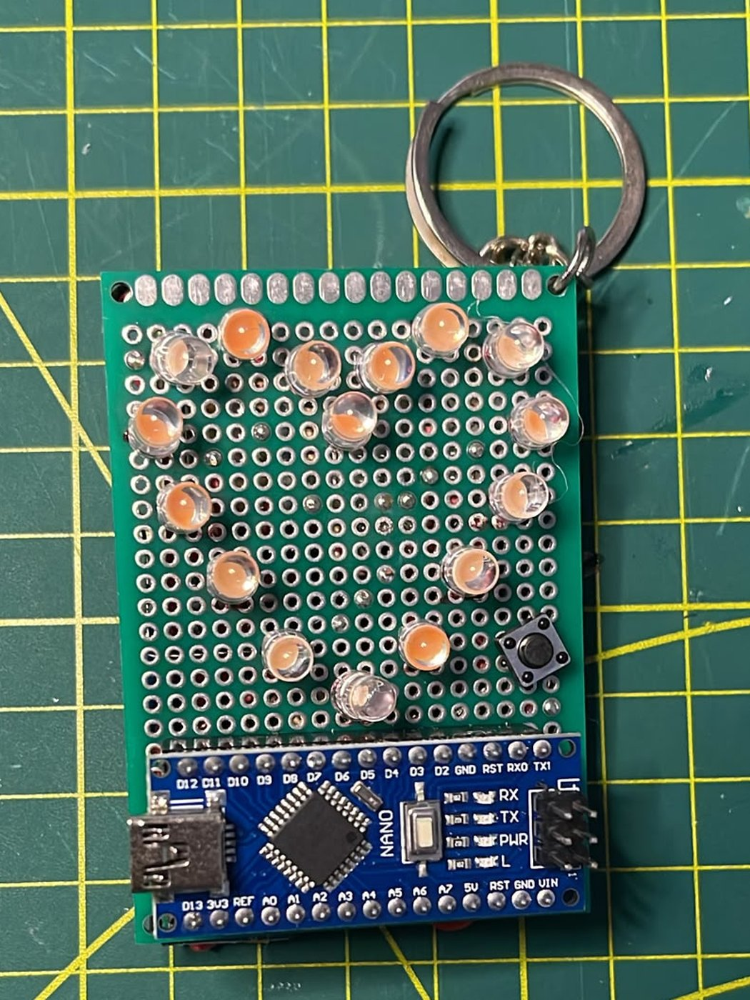
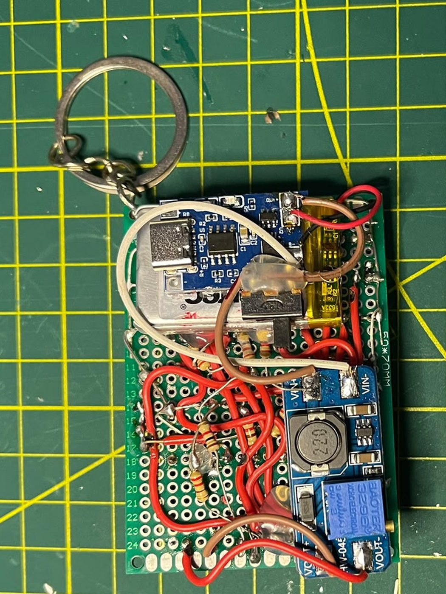
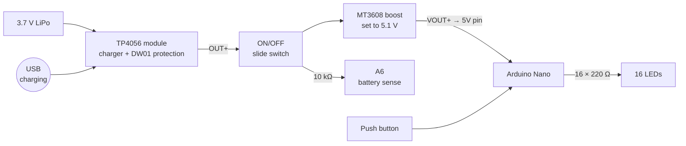
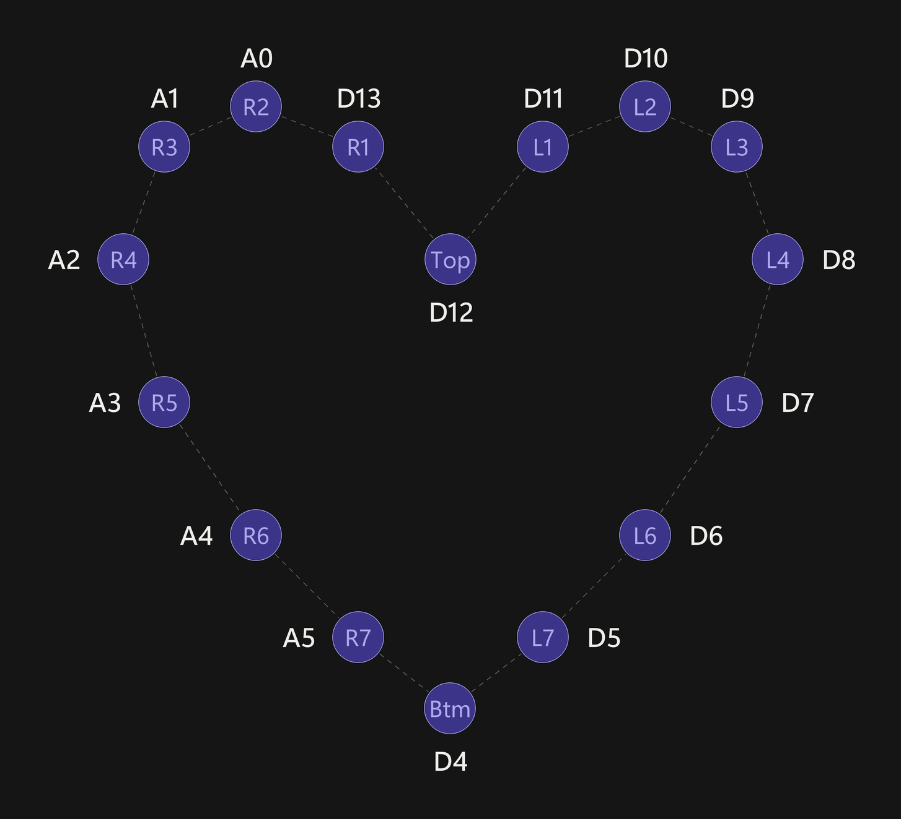
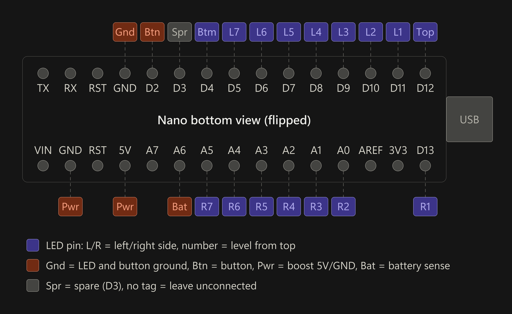

# Portable Heart LED ❤️

**An over-engineered LED heart keychain.** It has 16 LEDs, an Arduino Nano, a rechargeable LiPo and a USB charger, all on a 50 × 70 mm perfboard.
A push button cycles through **6 light modes**. It also has an on/off switch and a low-battery cutoff.

<p align="center">
  
  &nbsp;
  
  <br>
  <sub><b>Front:</b> LEDs, Nano and mode button &nbsp;·&nbsp; <b>Back:</b> charger, boost converter, battery, switch and wiring</sub>
</p>

---

## Table of contents

- [What's in this repo](#whats-in-this-repo)
- [How it works](#how-it-works)
- [Parts list](#parts-list)
- [Tools](#tools)
- [Board layout](#board-layout)
- [Reference diagrams](#reference-diagrams)
- [Wiring tables](#wiring-tables)
- [Build steps](#build-steps)
- [Programming the Nano](#programming-the-nano)
- [Tips so you don't mess it up](#tips-so-you-dont-mess-it-up)
- [Troubleshooting](#troubleshooting)
- [Credits](#credits)
- [License](#license)

---

## What's in this repo

| File | What it is |
| --- | --- |
| [`firmware/heart_led_portable/heart_led_portable.ino`](firmware/heart_led_portable/heart_led_portable.ino) | Arduino sketch (6 light modes + battery check) |
| [`schematic/heart_led_portable.pdf`](schematic/heart_led_portable.pdf) | Full schematic (KiCad) |
| [`images/LED_position_map.png`](images/LED_position_map.png) | Where every LED goes, **seen from the back** of the board |
| [`images/nano_pinout.png`](images/nano_pinout.png) | What connects to each Nano pin, **seen from the back** of the board |
| [`images/keychain_front.jpg`](images/keychain_front.jpg), [`images/keychain_back.jpg`](images/keychain_back.jpg) | Photos of the finished keychain |
| `LICENSE-*` | Licenses (see [License](#license)) |

---

## How it works



- The **TP4056** charges the LiPo over USB and protects it from over-charge, over-discharge and shorts.
- The **slide switch** turns everything on and off.
- The **MT3608** boosts the battery's 3.0–4.2 V up to a steady **~5.1 V**, which goes straight into the Nano's **5V pin**.
- Each of the **16 LEDs** has its own pin and its own **220 Ω** resistor, so every LED can be controlled on its own.
- A **10 kΩ** resistor feeds the battery voltage into **A6**. The code reads it and shuts the LEDs off before the battery gets too low.
- The **push button** on **D2** goes to GND and switches between the light modes.

---

## Parts list

| Qty | Part | Notes |
| :-: | --- | --- |
| 1 | Arduino Nano (ATmega328P) | A clone is fine. Get one with **headers not soldered** if you can, or use the ones it ships with |
| 2 | 15-pin **female** header strips | The Nano plugs into these. **Don't solder the Nano straight to the board.** Low-profile (round-pin) headers keep the keychain thinner |
| 16 | LEDs (3 mm or 5 mm) | Any colour. The keychain uses 5 mm |
| 16 | 220 Ω resistors | One per LED |
| 1 | 10 kΩ resistor | Battery sense on A6 |
| 1 | 6 × 6 mm tactile push button | Changes the light mode |
| 1 | Small SPDT slide switch | On/off |
| 1 | TP4056 charger module **with protection** | The one with **6 pads** (IN+/IN−, B+/B−, **OUT+/OUT−**). The 4-pad version has no battery protection. USB-C or micro-USB both work |
| 1 | MT3608 boost converter module | Set to **5.1 V** before you connect it (see step 2) |
| 1 | 3.7 V single-cell LiPo | Small enough to fit behind the board. **Read the [charging tip](#power-and-battery)**, because small batteries need a lower charge current |
| 1 | 50 × 70 mm double-sided perfboard | The size the keychain uses |
| 1 | Keyring + small chain or jump ring | Goes through a corner hole of the perfboard |
| — | Wire | Thin solid-core wire for the board, silicone wire for the battery and modules |

## Tools

- Soldering iron + solder (a fine tip makes this much easier)
- **Multimeter**: you need it to set the MT3608. Don't skip it.
- Flush cutters and wire strippers
- Small screwdriver for the MT3608 trimmer
- Helping hands or a PCB holder
- Optional: a breadboard (to hold the Nano's pins straight while you solder them), a fine marker, Kapton tape or heat-shrink

---

## Board layout

This is how the keychain in the photos is laid out on the 50 × 70 mm perfboard:

**Front**
- The 16 LEDs form the heart in the upper part of the board.
- The push button sits next to the heart.
- The Arduino Nano runs along the bottom edge, **with its USB port on the left**.
- The keyring goes through a top corner hole.

**Back**
- All the wiring and the 17 resistors.
- The TP4056 charger, the MT3608 boost converter, the LiPo and the slide switch.

> [!TIP]
> **Mount the Nano the same way:** on the front, along the bottom, USB on the left. Then the [pinout diagram](#nano-pinout-seen-from-the-back) matches exactly what you see on the back of the board. If you turn the Nano around, the diagram won't match anymore.

Keychain-specific tips:
- Put the **TP4056's USB port at the board edge** so you can plug a cable in.
- Put the **slide switch at an edge** so you can reach it without taking anything apart.
- **Set the MT3608 voltage before you mount it.** The trimmer can be hard to reach afterwards.
- **Protect the battery.** A keychain gets knocked around, and a trimmed lead or sharp solder joint can puncture a pouch cell. Cover the back with Kapton tape where the battery sits, and stick the battery down with double-sided tape.
- Keep the corner hole for the keyring free of wires and solder.

---

## Reference diagrams

### LED position map (seen from the BACK)

<p align="center"></p>

> [!IMPORTANT]
> This map shows the heart **as you see it from the back** (the solder side), because that's where you'll be soldering.
> When you flip the board over, the heart still points down but **left and right are swapped**.
>
> **L** and **R** are named as seen from the **front**. So from the back, the **L LEDs (D5–D11) are on your right** and the **R LEDs (D13, A0–A5) are on your left**.
> The number counts along that side of the heart, starting from the LED next to **Top**.

### Nano pinout (seen from the BACK)

<p align="center"></p>

> [!IMPORTANT]
> This is what you see on the **back of the board**, behind the Nano. The Nano is mounted on the front with its USB port on the left, as in the [layout](#board-layout).
> Because you're looking at the Nano from underneath, it's **mirrored** compared to the labels printed on top of it: from the back, the USB end is on the **right**, and **D12** and **D13** are the pins right next to it.
> Before you solder anything, check this against the labels printed on your own Nano.

| Colour | Meaning |
| --- | --- |
| 🟪 Purple | LED pin: L/R = side of the heart, number = position counted from Top |
| 🟧 Orange | **Gnd** = LED + button ground, **Btn** = button, **Pwr** = boost 5V/GND, **Bat** = battery sense |
| ⬜ Grey | **Spr** = spare (D3). Pins with no tag stay **unconnected** |

---

## Wiring tables

### LEDs

Every LED is wired the same way:

```
Nano pin ──[ 220 Ω ]──►|── GND
                     LED
              long leg (+)   short leg (−, flat side)
```

| LED | Nano pin | | LED | Nano pin |
| :-: | :-: | --- | :-: | :-: |
| **Top** | D12 | | **Btm** | D4 |
| L1 | D11 | | R1 | D13 |
| L2 | D10 | | R2 | A0 |
| L3 | D9 | | R3 | A1 |
| L4 | D8 | | R4 | A2 |
| L5 | D7 | | R5 | A3 |
| L6 | D6 | | R6 | A4 |
| L7 | D5 | | R7 | A5 |

### Everything else

| Nano pin | Connects to |
| --- | --- |
| **D2** | Push button (the other leg goes to GND) |
| **GND** (top row, next to D2) | LED ground bus + push button |
| **5V** | MT3608 **VOUT+** |
| **GND** (bottom row, next to VIN) | MT3608 **VOUT−** |
| **A6** | 10 kΩ resistor → MT3608 **VIN+** (the switched battery +) |
| D3 | Spare, free for your own add-ons |
| TX, RX, RST, VIN, A7, AREF, 3V3 | **Leave unconnected** |

### Power section

| From | To |
| --- | --- |
| LiPo **+** (red) | TP4056 **B+** |
| LiPo **−** (black) | TP4056 **B−** |
| TP4056 **OUT+** | Slide switch **middle** pin |
| Slide switch **outer** pin (either one) | MT3608 **VIN+** |
| TP4056 **OUT−** | MT3608 **VIN−** |
| MT3608 **VOUT+** | Nano **5V** |
| MT3608 **VOUT−** | Nano **GND** (bottom row) |
| MT3608 **VIN+** | 10 kΩ → Nano **A6** |

The other outer pin of the slide switch isn't used.

---

## Build steps

### 1. Test your parts first

- Test **every LED** before soldering it, using a coin cell or the multimeter's diode mode. Desoldering a dead LED from a finished heart is no fun.
- Check your LiPo's wire colours and polarity. Some batteries come with the connector wired backwards.

### 2. Set the MT3608 to 5.1 V **before connecting anything to it**

> [!CAUTION]
> MT3608 modules often ship set to a much **higher voltage**, sometimes 12 V or more.
> The Nano's **5V pin skips the onboard regulator**, so whatever voltage the MT3608 puts out goes straight into the chip.
> **An unadjusted MT3608 can kill your Nano the moment you switch it on.**

1. Connect only the battery (or a 3.7 V source) to MT3608 **VIN+ / VIN−**.
2. Put your multimeter on **VOUT+ / VOUT−**.
3. Turn the small trimmer screw **counter-clockwise** to lower the voltage. It's a multi-turn trimmer, so it can take **10–20 turns** before the reading starts to move.
4. Stop at **5.0–5.15 V**. The design uses **5.14 V**. Write down your reading, because it goes into `SUPPLY_V` in the code.
5. Check it again after the whole power section is wired up.

### 3. Solder the headers onto the Nano

If your Nano came with loose header pins:

- Push the pins into a **breadboard**, put the Nano on top and solder them. The breadboard keeps them straight and evenly spaced.
- Keep each joint short (2–3 seconds). You only need enough solder for a small shiny cone.

### 4. Solder **female headers** to the board, then plug the Nano into them

> [!TIP]
> **Don't solder the Nano directly to the perfboard.** Solder two 15-pin female headers instead and plug the Nano into them.
> - You can **pull the Nano out** to reprogram it, swap it or reuse it.
> - No heat goes into the Nano while you build.
> - You can **test all the wiring with the Nano removed** (see step 10).
> - A mistake costs you a cheap header, not the Nano.

- Put the headers on the **front**, along the bottom edge, so the Nano sits with its **USB port on the left** (see [Board layout](#board-layout)).
- Plug the Nano into the female headers **before** you solder them. It acts as a jig and keeps the two rows lined up perfectly. Tack one pin at each end, take the Nano out, then solder the rest.
- Use a fine marker on the back of the board to label the **USB end**, the **5V** and **GND** sockets, **D2** and **D13**. Once the Nano is plugged in you can't see the labels anymore.

### 5. Place the LEDs and resistors

- Push the LEDs through from the **front**, then flip the board and use the **[LED map](#led-position-map-seen-from-the-back)** (back view) to see which pin each one goes to.
- **Polarity:** the **long leg (+)** goes to the resistor (and then the Nano pin). The **short leg (−)**, on the **flat side** of the LED, goes to GND.
- Do one LED at a time: LED → resistor → wire to the right header socket. Check it against the table before moving on.
- Keep the resistor legs short and make sure they don't touch the legs next to them.

### 6. Make the ground bus

- Run one bare wire (or solder trail) around the heart and connect every LED's **short leg (−)** to it.
- Connect the ground bus to the Nano's **top-row GND** (the one next to D2).

### 7. Add the push button

- One leg to **D2**, the other leg to **GND**.
- On 4-leg tactile buttons, the legs on the same side are often **already connected inside**. Use two **diagonally opposite** legs so you know you're going through the switch.

### 8. Wire the power section

Follow the [power section table](#power-section):

- The battery goes to **B+ / B−**. Take power **out** from **OUT+ / OUT−**. If you take power from B+/B− you bypass the battery protection.
- TP4056 **OUT+** → **middle** pin of the slide switch → **outer** pin → MT3608 **VIN+**.
- TP4056 **OUT−** → MT3608 **VIN−**.
- MT3608 **VOUT+** → Nano **5V**, MT3608 **VOUT−** → Nano **bottom-row GND**.

### 9. Add the battery-sense resistor

- Solder the **10 kΩ** resistor from MT3608 **VIN+** (the switched battery +) to **A6**.

### 10. Check everything **before** plugging in the Nano

With the **Nano removed** from its headers:

1. **Short check:** switch **OFF**, multimeter on continuity, probe the **5V** socket against **each GND** socket. It should **not** beep.
2. **Voltage check:** switch **ON**, measure the **5V** socket against the **bottom-row GND** socket. You should read **~5.1 V**, and **not negative**.
3. **LED check:** the two GND sockets are only joined *inside* the Nano. So first **bridge the two GND sockets** with a jumper wire. Then, with the switch ON, take a second jumper from the **5V socket** and touch it to each **LED pin socket** one at a time. Each LED should light up, and it should be the right one according to the map. **Never touch the 5V jumper to a GND socket**, because that shorts the boost converter.
4. Switch **OFF** and remove the jumpers.

### 11. Plug in the Nano and power it up

- Check the Nano's orientation: the **USB end** must line up with the **D12/D13** end you marked. **Plugging it in backwards can destroy it.**
- Upload the code (see below), unplug USB, then flip the switch on.
- The heart starts in **mode 1 (all off)**, so nothing lights up until you **press the button**.

---

## Programming the Nano

The sketch is in [`firmware/heart_led_portable/heart_led_portable.ino`](firmware/heart_led_portable/heart_led_portable.ino). It doesn't need any extra libraries.

1. Install the [Arduino IDE](https://www.arduino.cc/en/software).
2. Download this repo (**Code → Download ZIP**) and open `firmware/heart_led_portable/heart_led_portable.ino`. Keep the `.ino` inside its `heart_led_portable` folder, because the Arduino IDE needs the folder and file names to match.
3. **Tools → Board → Arduino Nano**.
4. **Tools → Processor:** most clones need **ATmega328P (Old Bootloader)**. If the upload fails, try the other option.
5. Clones with a **CH340** USB chip may need the CH340 driver.
6. **Turn the power switch OFF while the Nano is on USB.** That way the USB 5V and the boost converter's 5V aren't fighting each other. The battery check knows when it's on USB and skips itself.
7. Click **Upload**.

### Light modes

Each press of the button moves to the next mode, and after mode 6 it goes back to mode 1:

| Mode | What it does |
| :-: | --- |
| 1 | All off (this is where it starts) |
| 2 | Drop: lights travel from **Top** down both sides to **Btm**, one level at a time |
| 3 | Alternating levels: even and odd levels flicker back and forth |
| 4 | Chaser: one LED runs clockwise around the heart |
| 5 | All LEDs blink on and off |
| 6 | All LEDs on, steady |

The button uses an interrupt, so it reacts immediately even in the middle of an animation.

### Low-battery cutoff

The sketch measures the battery on **A6** once a second. If it stays below **3.3 V** for 5 checks in a row, it turns all the LEDs off and briefly **flashes the Btm LED every 3 seconds**. That means **switch it off and charge it**. The Nano and the boost converter still draw a little power in this state, so don't leave it like that.

### Settings you can change

All of these are near the top of the sketch:

| Setting | Default | What it does |
| --- | --- | --- |
| `SUPPLY_V` | `5.14` | The voltage on your Nano's 5V pin. **Set this to what you measured on your MT3608** or the battery reading will be off |
| `LOW_BATTERY_V` | `3.30` | Battery voltage where the cutoff kicks in |
| `stage2Speed`, `stage3Speed`, `clockwiseSpeed`, `blinkSpeed` | 130 / 250 / 90 / 600 ms | Animation speeds (lower = faster) |
| `DEBUG_BATTERY` | `0` | Set to `1` to print the battery voltage in the Serial Monitor (9600 baud). The power switch must be ON for it to read the battery |

### Pin map used in the code

| Code | Pins |
| --- | --- |
| `topLed` / `bottomLed` | D12 / D4 |
| `leftSide[]` (L1 → L7) | D11, D10, D9, D8, D7, D6, D5 |
| `rightSide[]` (R1 → R7) | D13, A0, A1, A2, A3, A4, A5 |
| `buttonPin` | D2 (`INPUT_PULLUP`, other leg to GND) |
| `batteryPin` | A6 (through the 10 kΩ resistor) |

If you change any wiring, change these lines to match.

---

## Tips so you don't mess it up

### The big ones

- ⚠️ **Set the MT3608 to 5.1 V before connecting the Nano.** This is the #1 way people kill their Nano. ([step 2](#2-set-the-mt3608-to-51-v-before-connecting-anything-to-it))
- 🔌 **Use female headers, don't solder the Nano in.** ([step 4](#4-solder-female-headers-to-the-board-then-plug-the-nano-into-them))
- 🔄 **Remember the mirror.** Both diagrams show the **back of the board**, where you solder. Most "wrong LED lights up" problems come from forgetting this.
- 🔋 **Lower the TP4056 charge current for small batteries.** Keychain-size LiPos can't take the default 1 A. ([details](#power-and-battery))
- ↕️ **Get the Nano the right way round.** USB goes at the D12/D13 end. Mark it on the board.
- ➕ **Check LED polarity:** long leg = **+** (to the resistor), short leg / flat side = **−** (to GND).

### Power and battery

- Feed the boost output into the **5V pin, not VIN**. VIN goes through a regulator that needs 7 V or more, so 5 V into VIN won't run the Nano properly.
- Charge through the **TP4056's USB port**. The Nano's USB port does **not** charge the battery.
- Charge with the switch **OFF** if you can. If the Nano is drawing power while charging, the TP4056 may never see the battery as full.
- The TP4056 charges at **1 A** by default, which is too much for the small LiPos that fit in a keychain. A safe rule is to keep the charge current **at or below the battery's capacity** (for example, 300 mA or less for a 300 mAh battery). To lower it, swap the module's R_PROG resistor (usually marked **R3**, 1.2 kΩ):

  | Battery | R_PROG | Charge current |
  | --- | --- | --- |
  | ~1000 mAh or more | 1.2 kΩ (default) | ~1 A |
  | ~500 mAh | 2.4 kΩ | ~500 mA |
  | ~300 mAh | 4 kΩ | ~300 mA |
  | ~250 mAh | 5 kΩ | ~250 mA |
  | ~130 mAh | 10 kΩ | ~130 mA |
- When you strip or cut the battery leads, **do one wire at a time** so they never touch. A shorted LiPo gets dangerously hot.
- Put Kapton tape or heat-shrink on the back of the TP4056 and MT3608 if they sit against the board or the battery.

### Soldering

- Use about **330–350 °C** and keep each joint to **2–3 seconds**. LEDs and plastic headers don't like heat.
- Trim leads right after soldering so they don't bend over and short against their neighbours.
- Check joints with a light behind the board. A good joint is shiny and cone-shaped, not a dull ball.

### LED current

- With 220 Ω at 5 V, each LED draws about **9–14 mA** depending on its colour. Red and yellow draw the most.
- Modes 5 and 6 light all 16 LEDs at once. With red LEDs that adds up to over 200 mA, which is around the ATmega328P's total current limit. If you use red or yellow LEDs and like to leave it on mode 6, use **330 Ω** resistors to keep the current down.

### Pins

- **D0/D1 (TX/RX)** are left free on purpose because the USB upload uses them. Keep it that way.
- **A6 and A7 are analog-input only**. That's why A6 is used for battery sense and not for an LED.
- **D3** is free if you want to add something (it also supports PWM).

---

## Troubleshooting

| Problem | What to check |
| --- | --- |
| Nothing lights up after switching on | That's normal: it starts in **mode 1 (all off)**. Press the button |
| Still nothing after pressing the button | Is the battery charged? Do you read ~5.1 V on the 5V socket? Is the Nano plugged in the right way round? Was the sketch uploaded? |
| All LEDs go off and Btm flashes every 3 s | **Low battery.** Switch off and charge it |
| One LED never lights | It's probably **backwards** (long leg must go to the resistor), has a cold joint, or is a dead LED. Use the jumper test from [step 10](#10-check-everything-before-plugging-in-the-nano) |
| The wrong LED lights up | **Mirrored wiring.** Compare against the map, which is a **back view** |
| LEDs flicker or the Nano resets | The battery is low (charge it) or the MT3608 is set too low. Measure the 5V pin while the LEDs are on |
| The button doesn't change modes | Check the button goes from **D2** to **GND**. On a 4-leg button use **diagonal** legs |
| Upload fails | Try **ATmega328P (Old Bootloader)**, install the CH340 driver, use a USB **data** cable (not charge-only), switch the power OFF |
| Cutoff kicks in too early or too late | Set `SUPPLY_V` in the sketch to your measured 5V-pin voltage, and check the 10 kΩ goes to the **switched** side (MT3608 VIN+). Use `DEBUG_BATTERY 1` to see the reading |
| TP4056 LED never shows "full" | Switch the heart **OFF** while charging |

---

## Credits

Designed by **[@diaawastaken](https://www.instagram.com/diaawastaken/)** on Instagram. If you build one, share it and tag me for a shoutout! ❤️

---

## License

Each part of the project uses the license that fits it:

| Part | License | File |
| --- | --- | --- |
| Firmware ([`firmware/`](firmware/)) | [MIT](https://opensource.org/license/mit) | [`LICENSE-FIRMWARE`](LICENSE-FIRMWARE) |
| Hardware design ([`schematic/`](schematic/)) | [CERN-OHL-P v2](https://ohwr.org/cern_ohl_p_v2.txt) | [`LICENSE-HARDWARE`](LICENSE-HARDWARE) |
| Docs and images (this README, [`images/`](images/)) | [CC BY 4.0](https://creativecommons.org/licenses/by/4.0/) | [`LICENSE-DOCS`](LICENSE-DOCS) |

**In short:** you're free to build it, change it, share it and use it in your own projects, as long as you keep the credit to **@diaawastaken**. See each license file for the full terms.
